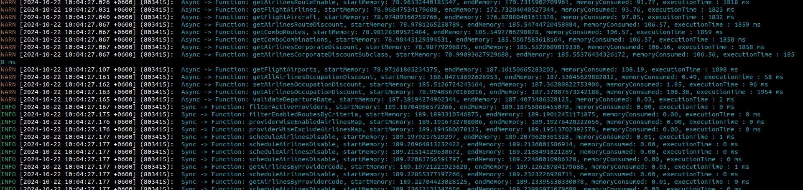

# Memory Profiler for NestJS

 

A reusable memory profiling tool for NestJS services, providing easy-to-apply decorators to track memory consumption in both synchronous and asynchronous methods.

## Features

- Memory profiling for all methods in a service class.
- Separate decorators for profiling individual sync and async functions.
- Uses the `pino` logger for detailed asynchronous, color-coded console output.
- Configurable via environment variables.

## Installation

```bash
npm install @mahabub-arafat/memory-profiler
```

## Setup

1. Add a `.env` file to your project and enable memory profiling by setting:

```env
ENABLE_MEMORY_PROFILING_DECORATOR=true
```

2. Import the profiler into your service and apply the `ProfileAllMethods` decorator:

### Example

```typescript
import { Injectable } from '@nestjs/common';
import { ProfileAllMethods } from '@mahabub-arafat/memory-profiler';

@Injectable()
@ProfileAllMethods()
export class AppService {
    async getAvailableFlights() {
        // some logic
    }

    async timedoutSearch() {
        // some logic
    }
}
```

When this service's methods are executed, the memory consumption will be logged to the console:

### Output Example

```plaintext
INFO [2024-10-23 10:51:53.710 +0600] (776639 on st):  Async -> Function: getAvailableFlights, startMemory: 45.57MB, endMemory: 44.62MB, memoryConsumed: -0.95MB, executionTime : 2450 ms
WARN [2024-10-23 10:52:21.261 +0600] (776639 on st):  Async -> Function: timedoutSearch, startMemory: 42.17MB, endMemory: 36.15MB, memoryConsumed: -6.02MB, executionTime : 30000 ms
```
Terminal Output: 


## Usage

### Profile All Methods in a Class

To apply memory profiling to all methods in a service class, use the `ProfileAllMethods` decorator:

```typescript
import { Injectable } from '@nestjs/common';
import { ProfileAllMethods } from '@mahabub-arafat/memory-profiler';

@Injectable()
@ProfileAllMethods()
export class SomeService {
    // Your service methods
}
```

### Profile a Single Sync Function

For profiling individual synchronous functions, use `ProfileMemorySyncFunction`:

```typescript
import { ProfileMemorySyncFunction } from '@mahabub-arafat/memory-profiler';

export class SomeService {
    @ProfileMemorySyncFunction()
    someSyncMethod() {
        // Your method logic
    }
}
```

### Profile a Single Async Function

For profiling individual asynchronous functions, use `ProfileMemoryAsyncFunction`:

```typescript
import { ProfileMemoryAsyncFunction } from '@mahabub-arafat/memory-profiler';

export class SomeService {
    @ProfileMemoryAsyncFunction()
    async someAsyncMethod() {
        // Your async method logic
    }
}
```

## Configuration

The memory profiler is controlled via an environment variable:

- `ENABLE_MEMORY_PROFILING_DECORATOR=true`: Enables the memory profiling decorators.

If the variable is not set or set to `false`, the decorators will be ignored.

## Logging

The memory profiler uses `pino` with `pino-pretty` for enhanced console logging. You can customize the logging format in the `utilities.ts` file or directly in the code as needed.

## License

This project is licensed under the Apache License 2.0 . See the [LICENSE](./LICENSE) file for details.

## Contributing

Contributions are welcome! Feel free to submit a pull request or open an issue on the [GitHub repository](https://github.com/mahabubarafat-st/memory-profiler).

